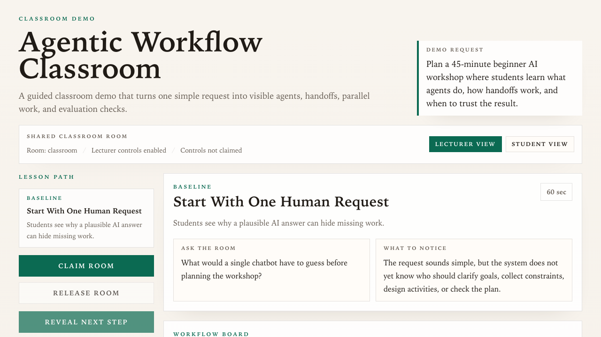

# agentic-workflow-classroom

`agentic-workflow-classroom` is a small Cloudflare Worker demo for teaching agents and agentic workflows to students who are new to the topic.

The app adapts the classroom pacing of `french-cheese-shop-demo` to solve the main issue found in `agentic-workflow-simulator`: students should not have to understand a full workflow studio before they understand the basic ideas. Instead, the lecturer reveals one concept at a time through a concrete workshop-planning problem:

- baseline request: why one plausible AI answer hides missing work
- agent roles: what each agent receives, does, and returns
- workflow order: what runs sequentially and what can run in parallel
- handoffs: what packet moves from one agent to the next
- evaluation: how to check the workflow trace, not only the final answer

The runtime stays deterministic and local. There are no accounts, no backend persistence, and no remote AI calls in the teaching path.

## Quick Demo

1. Start the app with `npm run dev`.
2. Open `http://127.0.0.1:8787`.
3. Begin with the visible request: `Plan a 45-minute beginner AI workshop where students learn what agents do, how handoffs work, and when to trust the result.`
4. In lecturer view, claim the room and use `Reveal next step` to move from baseline to agents, workflow order, handoffs, and evaluation.
5. At each step, ask the room the visible question, then use the workflow board to point at the changed agent, time slot, or handoff packet.
6. Use `Student Activity` choices when you want the class to decide one improvement before you explain the next system change.

## Lecturer And Student Views

Use a shared room id when students should work together:

- Lecturer: `http://127.0.0.1:8787/?room=classroom&role=lecturer`
- Students: `http://127.0.0.1:8787/?room=classroom&role=student`

The lecturer view can claim the room before teaching. Only the device holding the room claim can reveal steps, switch between revealed steps, reset the room, or release the claim for another lecturer device. Student views hide those controls, show only revealed steps, and contribute votes in the shared activity panel.

The current room model is intentionally lightweight in-memory Worker state with a local browser claim token. It is enough for local rehearsal and short classroom demos, but it is not durable storage or authentication.

The point is not to teach every possible agent architecture. It is to make the first mental model concrete: agents have jobs, workflows arrange those jobs over time, handoffs carry state, and evaluation checks the path.

## Documentation

- Development setup and local CI: `docs/development.md`
- Architecture decisions: `docs/adrs/README.md`
- Feature and architecture specs: `specs/README.md`
- Agent behavior and project rules: `AGENTS.md`
- Classroom demo contract: `specs/agentic-workflow-classroom/spec.md`

The repo vendors ASDLC reference material in `.asdlc/` as local guidance instead of recreating it per project. Repo-specific truth lives in `ARCHITECTURE.md`, `specs/`, and `docs/adrs/`: generated code still needs to match those documents, and passing CI alone is not enough.

Local development in this repo targets macOS. Other platforms may need script and tooling adjustments before the baseline workflow works as documented.

## Runtime

- Run `nvm use` before `npm install` or any other development command so your shell picks up the repo-pinned Node.js version from `.nvmrc`.
- Install dependencies with `npm install`.
- `npm install` also configures the repo-managed `pre-push` hook so `git push` runs `npm run quality:gate:fast`.
- Start the Worker with `npm run dev`, then open `http://127.0.0.1:8787`.
- Rebuild the generated Tailwind stylesheet manually with `npm run build:css` when needed.

## Verification

- Run the fast local gate with `npm run quality:gate:fast` during normal iteration.
- Run the baseline repo gate with `npm run quality:gate`.
- Run the containerized local workflow with `npm run ci:local`.
- Refresh the committed README screenshot with `npm run screenshot:home` when the classroom UI changes materially.
- If local Agent CI warns about `No such remote 'origin'`, set `GITHUB_REPO=owner/repo` in `.env.agent-ci`.
- Install the pinned Playwright browser with `npm run playwright:install`.
- Run unit tests with `npm test`.
- Run browser tests with `npm run e2e`.

## Source Layout

- `src/worker.ts` is the Worker entry point and top-level router.
- `src/api/` holds API response modules such as the health endpoint.
- `src/views/` holds HTML rendering modules for the classroom UI.
- Tests live next to the code they exercise under `src/`.

## Application Screenshot

Refresh this asset locally with `npm run screenshot:home` when the classroom UI changes materially.
